# Causality-0

🌍 [English](README.md) | [简体中文](README_zh-CN.md)

<p align="center">
  
  
  
  
  
  
  
  
  
</p>

<p align="center">
  <strong>Server-side round recording and deterministic replay for SCP:SL.</strong>
</p>

<p align="center">
  <em>Record a round. Freeze its world. Rebuild it on the correct seed, at the correct speed, through the native movement stack.</em>
</p>

> A multiplayer round should not disappear the moment it ends.

---

## Why Causality-0 exists

Causality-0 is not a log dumper and not a fake cinematic tool.
It is a **server-authoritative round reconstruction system** for [SCP: Secret Laboratory](https://scpslgame.com/), built on [LabAPI](https://github.com/northwood-studios/LabAPI).

The goal is simple:

- record what really happened
- preserve the world state that made it meaningful
- serialize it into a compact binary replay asset
- restore it later through native game systems instead of low-quality teleports

That is why the project stores not only actor transforms, but also:

- map seed
- replay FPS
- deterministic frame time
- input intent
- projectiles
- voice packets
- health and armor state
- door interaction timing

---

## Technical pillars

| Pillar | What it does | Why it matters |
| --- | --- | --- |
| ⏱️ Deterministic Timeline | Drives recording and playback by frame index and step size instead of loose wall-clock drift | Prevents desync between actor motion, interaction events, and audio |
| 🧠 Native FPC Hijacking | Feeds the native [`FpcMotor`](Core/Timeline.cs) path instead of relying on crude transform snapping | Preserves movement semantics, animation rhythm, and footstep logic |
| 💾 `.c0` Binary Protocol | Stores seed, protocol version, replay FPS, actor tracks, audio packets, interactions, and more | Makes replay files portable, inspectable, and backward-compatible |
| 🌍 Seed-Locked Playback | Refuses wrong-world playback and can schedule a restart with the replay seed | Prevents layout mismatch, wrong doors, wrong rooms, and broken spatial context |
| 🎯 World-State Fidelity | Replays firearms, consumables, health, AHP, projectiles, doors, and voice | Makes the replay feel like a live round, not a mannequin demo |

---

## Black tech overview

### ⏱️ Deterministic Timeline

Causality-0 no longer trusts real-time drift inside the replay loop.
The replay clock is derived from:

- current frame index
- configured FPS
- frame step

This means every subsystem can be aligned to the same source of truth:

- actor transforms
- item actions
- audio packet release
- door interaction frames
- projectile puppet progression

### 🧟 Native FPC Hijacking

The project does **not** treat dummy actors like static puppets.
It pushes motion through the native first-person movement stack so the engine can still reason about movement the way SCP:SL expects.

Current direction of the project:

- preserve native FPC state
- drive replay through target-position semantics
- keep movement state consistent with replayed intent
- avoid cheap transform-only playback whenever native systems can be reused

### 💾 `.c0` Binary Protocol

Current replay files are written with protocol **V8**.
The format stores:

| Field | Type | Notes |
| --- | --- | --- |
| Magic | string | `CAUS` |
| Version | byte | `8` |
| MapSeed | `Int32` | Original facility seed |
| CurrentFps | `Int32` | Recording FPS stored inside the file |
| Actor tracks | structured binary | Role, frames, state, input, stats |
| Audio packets | structured binary | Timestamped voice payloads |
| Interaction frames | structured binary | Door interaction timing and IDs |

Compatibility policy:

- `V8+` replays restore the FPS embedded in the file
- pre-`V8` replays automatically fall back to `15 FPS`

That is why old `.c0` files no longer play like fast-forward footage on newer builds.

### 🌍 Seed-Locked World Replay

Playback is only meaningful if the world is still the same world.
Causality-0 records the original map seed and checks it before playback.

Current behavior:

- if the replay seed matches the current map seed, playback is allowed
- if `load` detects a mismatch, it schedules a forced round restart using the replay seed
- after the next map generation, the seed override is consumed once and released

This keeps replay integrity without permanently hard-locking the server to one seed.

---

## Replay lifecycle

```mermaid
flowchart LR
    A[Live SCP:SL round] --> B[Capture frame state<br/>input voice doors projectiles]
    B --> C[Deterministic timeline<br/>frame_index * Step]
    C --> D[Serialize .c0<br/>CAUS + V8 + seed + fps]
    D --> E[Load replay file]
    E --> F{Seed matches current map?}
    F -- No --> G[Schedule replay seed<br/>force round restart]
    F -- Yes --> H[Spawn dummy actors]
    G --> H
    H --> I[Drive native FPC path<br/>through replay movement targets]
    I --> J[Native movement / footsteps / animation rhythm]
    J --> K[Replay items doors projectiles voice stats]

    classDef a fill:#0b1220,stroke:#7aa2f7,color:#e5e7eb,stroke-width:1.5px;
    classDef b fill:#102a43,stroke:#38bdf8,color:#e5e7eb,stroke-width:1.5px;
    classDef c fill:#132f12,stroke:#22c55e,color:#e5e7eb,stroke-width:1.5px;
    classDef d fill:#3b0a45,stroke:#f472b6,color:#e5e7eb,stroke-width:1.5px;

    class A,E,F,G a;
    class B,C,H,I b;
    class J,K c;
    class D d;
```



---

## Project layout

Core source files worth reading first:

- [Causality0.cs](Causality0.cs)
- [Core/Timeline.cs](Core/Timeline.cs)
- [Core/Serializer.cs](Core/Serializer.cs)
- [Core/DummyMotorWrapper.cs](Core/DummyMotorWrapper.cs)
- [Core/DummyInputWrapper.cs](Core/DummyInputWrapper.cs)
- [Event/ServerEvent/MapGenerating.cs](Event/ServerEvent/MapGenerating.cs)
- [Event/PlayerEvent/VoiceChat.cs](Event/PlayerEvent/VoiceChat.cs)
- [Event/PlayerEvent/Interacting.cs](Event/PlayerEvent/Interacting.cs)
- [Command/RemoteAdmin/Causality.cs](Command/RemoteAdmin/Causality.cs)

---

## Command surface

```bash
causality start
causality stop
causality save scrim_2026_03_08
causality load scrim_2026_03_08
causality spawn
causality play
```

### Command behavior

| Command | Purpose |
| --- | --- |
| `causality start` | Begin round recording |
| `causality stop` | Seal the in-memory timeline |
| `causality save <name>` | Write a `.c0` replay file |
| `causality load <name>` | Load a replay file and validate seed/FPS metadata |
| `causality spawn` | Spawn dummy actors for loaded tracks |
| `causality play` | Start deterministic in-game playback |

Seed-sensitive behavior:

- `load` can schedule a forced restart with the replay seed
- `play` is blocked if the current seed still does not match the replay seed

---

## Feature grid

### Recorded

- positions and rotations
- movement state and grounded state
- held item and attachment code
- shooting and reloading intent
- usable item start / cancel intent
- health and armor values
- voice packet timeline
- door interaction timing
- projectile tracks

### Replayed

- dummy actor motion
- native item switching
- firearm attachment restoration
- projectile puppets and native fuse endpoints
- world-space voice rebroadcast
- door interaction replay
- health / AHP state projection
- deterministic frame clock playback

---

## Compatibility notes

### Replay FPS

Replay speed is no longer hardcoded by runtime assumptions.
It is defined by the file itself.

| Replay file version | Playback FPS behavior |
| --- | --- |
| `V8+` | Uses stored `CurrentFps` |
| `< V8` | Forced compatibility fallback to `15 FPS` |

### Map seed

Replay world validity is enforced by recorded seed.
A replay is treated as a world-specific artifact, not a generic animation clip.

---

## Developer experience

### Environment assumptions

- SCP:SL dedicated server runtime
- LabAPI plugin environment
- .NET Framework `4.8.1`
- server-authoritative replay workflow

### Design principles

- prefer native engine paths over cosmetic fakes
- prefer deterministic frame logic over real-time drift
- prefer binary replay assets over fragile text dumps
- prefer explicit compatibility rules over silent corruption

---

## Roadmap

- [x] Deterministic frame-driven replay clock
- [x] Dynamic FPS replay protocol
- [x] `.c0` protocol V8 with replay FPS persistence
- [x] Seed-aware replay loading and restart scheduling
- [x] Native projectile puppet path and fuse endpoint playback
- [x] Door interaction recording and playback
- [x] Voice packet capture and spatial replay
- [x] Health and AHP synchronization
- [x] Consumable use / cancel replay
- [ ] V9 ragdoll and death-pose reconstruction
- [ ] Replay visualization and offline inspector tooling
- [ ] Rust-powered metadata hub / analysis backend
- [ ] More configurable replay policy through runtime config

---

## License

This project is distributed under the terms of [GNU AGPL v3](LICENSE.txt).

---

## Final note

Causality-0 is built for people who do not want a round to vanish after the scoreboard.
It is for debugging, reviewing, teaching, investigating, showcasing, and eventually archiving multiplayer history as something you can actually step back into.