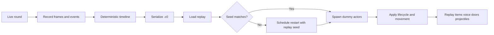

# Causality-0

🌍 [English](README.md) | [简体中文](README_zh-CN.md)

<p align="center">
  
  
  
  
  
  
  
  
</p>

<p align="center">
  <strong>A deterministic replay engine for SCP:SL rounds.</strong>
</p>

<p align="center">
  <em>What vanishes from the server should still remain readable in time.</em>
</p>

> A multiplayer round should not disappear the moment it ends.

---

## Overview

Causality-0 is a LabAPI-based replay plugin for SCP: Secret Laboratory.
It records server-side player state into a deterministic timeline, serializes it as a `.c0` replay file, and later reconstructs that round in-game with dummy actors, preserved timing, and seed-aware playback rules.

It is built less as a spectacle system and more as a way to leave a round behind in a form that can still be revisited.

---

## Current architecture

### ⏱️ Deterministic timeline

Replay time is driven by frame index and step size instead of wall-clock drift.
That keeps:

- actor movement
- voice packets
- interaction events
- projectile motion

bound to the same timeline.

### 🧟 Native actor playback

The project does not treat replay as pure transform theater.
Where possible, it reuses native SCP:SL systems so movement, state, and side effects stay closer to the game’s own rules.

### 💾 `.c0` binary protocol

Current replay protocol version is **V9**.

It stores:

| Field | Notes |
| --- | --- |
| Map seed | Used to validate world correctness |
| Replay FPS | Embedded in the file for playback speed |
| Actor frames | Position, rotation, item state, stats |
| Audio packets | Timestamped raw voice payloads |
| Interaction frames | Door interaction timing |
| Lifecycle events | Role changes and death events |

### 🌍 Seed-aware playback

Replay is world-sensitive.
If the replay seed does not match the current map, playback can be blocked or the next round can be scheduled to regenerate with the replay seed.

### ♻️ Lifecycle event stream

An actor track no longer means a single uninterrupted life.
The replay format now supports:

- role changes
- death events
- spectator phases
- later respawn / reassignment playback

---

## Replay lifecycle



---

## What is currently recorded

- player position and rotation
- movement state and grounded state
- held item and firearm attachments
- shooting and reloading intent
- usable item start / cancel intent
- health and armor-like values
- voice packets
- door interaction timing
- projectile tracks
- role-change events
- death events

---

## Command surface

`c0` is available as a short alias of `causality`.

```bash
causality start
causality stop
causality save <name>
causality load <name>
causality spawn
causality play

c0 start
c0 stop
c0 save <name>
c0 load <name>
c0 spawn
c0 play
```

### Behavior notes

- `load` reads `.c0` metadata, including seed and replay FPS
- old replay files fall back to a compatibility FPS path
- playback is blocked if actors are missing
- playback can be blocked or deferred if the current map seed does not match the replay seed

---

## Core files

- [Causality0.cs](Causality0.cs)
- [Core/Timeline.cs](Core/Timeline.cs)
- [Core/Serializer.cs](Core/Serializer.cs)
- [Core/ActorTrack.cs](Core/ActorTrack.cs)
- [Core/LifecycleEvent.cs](Core/LifecycleEvent.cs)
- [Core/DamageData.cs](Core/DamageData.cs)
- [Core/DummyInputWrapper.cs](Core/DummyInputWrapper.cs)
- [Core/DummyMotorWrapper.cs](Core/DummyMotorWrapper.cs)
- [Command/RemoteAdmin/Causality.cs](Command/RemoteAdmin/Causality.cs)
- [Event/ServerEvent/MapGenerating.cs](Event/ServerEvent/MapGenerating.cs)
- [Event/PlayerEvent/VoiceChat.cs](Event/PlayerEvent/VoiceChat.cs)
- [Event/PlayerEvent/Interacting.cs](Event/PlayerEvent/Interacting.cs)
- [Event/PlayerEvent/Lifecycle.cs](Event/PlayerEvent/Lifecycle.cs)

---

## Roadmap

The next steps should feel like a continuation of the same timeline, not a promise made too far ahead of the code.

- [x] Deterministic replay timing
- [x] Dynamic replay FPS metadata
- [x] Seed-aware replay loading
- [x] Voice packet capture and playback
- [x] Door interaction recording and playback
- [x] Projectile replay path
- [x] Actor lifecycle event stream
- [ ] Broaden interaction replay beyond doors
- [ ] Stabilize death and ragdoll playback edge cases
- [ ] Improve replay inspection and debugging tools
- [ ] Add configuration-driven replay policy

---

## License

This project is distributed under the terms of [GNU AGPL v3](LICENSE.txt).

---

## Final note

Causality-0 is still experimental.
But a round may end at the scoreboard, and its causality does not have to end with it.
This project exists to leave that causality on the server, waiting to be called back in the correct world.