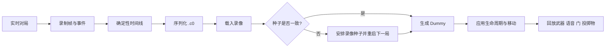

# Causality-0

🌍 [English](README.md) | [简体中文](README_zh-CN.md)

<p align="center">
  
  
  
  
  
  
  
  
</p>

<p align="center">
  <strong>面向 SCP:SL 回合的确定性重演引擎。</strong>
</p>

<p align="center">
  <em>从服务器里消失的，不该就此从时间里消失。</em>
</p>

> 一场多人对局，不该在结束的那一刻就彻底消失。

---

## 项目定位

Causality-0 是一个基于 LabAPI 的 SCP:SL 服务端回放插件。
它会把玩家状态、事件和世界交互录制成一条确定性时间线，序列化为 `.c0` 文件，并在之后通过 Dummy 与原生系统把这场对局重新拉回服务器中。

它想做的，不是把一局对局表演出来，而是把它留存下来，让它依然能够被重新走近。

---

## 当前架构重点

### ⏱️ 确定性时间轴

回放时间不再依赖现实时间漂移，而是由帧索引和步长推进。
这样：

- 人物位移
- 语音包
- 交互事件
- 投掷物运动

都会被绑在同一条时间线上。

### 🧟 原生角色回放

项目不会把回放只做成 Transform 的表面演出。
在能走原生系统的地方，它尽量复用 SCP:SL 自己的角色与状态链，让回放更接近游戏本身的规则。

### 💾 `.c0` 二进制协议

当前协议版本是 **V9**。

它保存：

| 字段 | 说明 |
| --- | --- |
| 地图种子 | 用于校验世界是否正确 |
| 回放 FPS | 文件内保存录制帧率 |
| 角色帧数据 | 位姿、状态、持物、数值 |
| 语音包 | 带时间戳的原始语音负载 |
| 交互帧 | 当前已实现门交互时间点 |
| 生命周期事件 | 角色切换与死亡事件 |

### 🌍 地图种子校验

回放不是抽象动画，而是发生在某个具体地图种子上的世界事件。
如果种子不匹配，插件可以阻止播放，或者安排下一局切换到录像种子后再继续。

### ♻️ 生命周期事件流

现在一条演员轨道不再只代表一条命。
录像已经支持：

- 角色切换
- 死亡事件
- 死后观战阶段
- 后续重生 / 再次分配角色

---

## 回放生命周期图



---

## 当前已录制内容

- 玩家位置与旋转
- 移动状态与触地状态
- 当前持物与枪械配件
- 开火与换弹输入
- 消耗品开始 / 取消使用
- HP 与护甲类数值
- 原始语音包
- 门交互时间点
- 投掷物轨迹
- 角色切换事件
- 死亡事件

---

## 指令面

`c0` 现在可以作为 `causality` 的缩写别名使用。

```bash
causality start
causality stop
causality save <name>
causality load <name>
causality spawn
causality play

c0 start
c0 stop
c0 save <name>
c0 load <name>
c0 spawn
c0 play
```

### 当前行为

- `load` 会读取 `.c0` 中的种子和 FPS 元数据
- 旧版本录像会走兼容帧率回放
- 如果演员没生成，`play` 会拦截
- 如果地图种子不一致，插件可以阻止播放或安排重启

---

## 关键源码入口

- [Causality0.cs](Causality0.cs)
- [Core/Timeline.cs](Core/Timeline.cs)
- [Core/Serializer.cs](Core/Serializer.cs)
- [Core/ActorTrack.cs](Core/ActorTrack.cs)
- [Core/LifecycleEvent.cs](Core/LifecycleEvent.cs)
- [Core/DamageData.cs](Core/DamageData.cs)
- [Core/DummyInputWrapper.cs](Core/DummyInputWrapper.cs)
- [Core/DummyMotorWrapper.cs](Core/DummyMotorWrapper.cs)
- [Command/RemoteAdmin/Causality.cs](Command/RemoteAdmin/Causality.cs)
- [Event/ServerEvent/MapGenerating.cs](Event/ServerEvent/MapGenerating.cs)
- [Event/PlayerEvent/VoiceChat.cs](Event/PlayerEvent/VoiceChat.cs)
- [Event/PlayerEvent/Interacting.cs](Event/PlayerEvent/Interacting.cs)
- [Event/PlayerEvent/Lifecycle.cs](Event/PlayerEvent/Lifecycle.cs)

---

## Roadmap

接下来的路，应该像时间线本身一样，从已经发生的东西里自然长出来。

- [x] 确定性回放时间轴
- [x] 动态 FPS 回放元数据
- [x] 地图种子校验与重启调度
- [x] 原始语音包录制与回放
- [x] 门交互录制与回放
- [x] 投掷物回放路径
- [x] 角色生命周期事件流
- [ ] 扩展更多世界交互对象的回放
- [ ] 稳定死亡与布娃娃回放边界情况
- [ ] 增强录像检查与调试工具
- [ ] 增加配置化回放策略

---

## 许可证

本项目使用 [GNU AGPL v3](LICENSE.txt) 许可证。

---

## 结语

Causality-0 仍然是实验性的。
但一局可以在结算时结束，它的因果却不必随之熄灭。
这个项目想做的，就是把那条因果留在服务器里，等你在正确的世界里把它重新唤回。