# Causality-0

🌍 [English](README.md) | [简体中文](README_zh-CN.md)

<p align="center">
  
  
  
  
  
  
  
  
  
</p>

<p align="center">
  <strong>面向 SCP:SL 的服务端回合录制与确定性重演系统。</strong>
</p>

<p align="center">
  <em>记录一局，冻结它的世界，把它按正确的种子、正确的帧率、正确的原生移动语义重新拉回服务器里。</em>
</p>

> A multiplayer round should not disappear the moment it ends.

---

## 项目定位

Causality-0 不是单纯的日志插件，也不是廉价的“假人瞬移演示器”。
它是一个建立在 [LabAPI](https://github.com/northwood-studios/LabAPI) 之上的 **服务端回合重建系统**，目标是把一场已经结束的 SCP:SL 对局，重新作为“可进入、可观察、可分析的时序资产”保留下来。

它真正想做的是：

- 记录一局里真实发生了什么
- 保留让这场对局成立的地图环境与时间关系
- 序列化成可分享的 `.c0` 二进制录像
- 在未来某个时刻，通过原生系统把它重新播放出来

所以它记录的不只是坐标，还包括：

- 地图种子
- 录像帧率
- 确定性帧时间轴
- 输入意图
- 投掷物轨迹
- 原始语音包
- 血量与护甲状态
- 门交互时机

---

## 核心黑科技

| 模块 | 作用 | 价值 |
| --- | --- | --- |
| ⏱️ 确定性时间轴 | 所有录制与回放都绑定到“帧索引 * 步长” | 杜绝人物、音频、交互各走各的时间线 |
| 🧟 原生 FPC 接管 | 不走低质量瞬移回放，而是尽量把数据喂回原生第一人称移动链 | 保留真实的移动节奏、动画感与脚步语义 |
| 💾 `.c0` 二进制协议 | 把种子、FPS、轨道、语音、交互等写进一套可演进协议 | 支持跨设备分享、版本兼容和后续分析工具 |
| 🌍 种子锁定回放 | 播放前校验地图种子，不匹配则安排下一局切换录像种子 | 防止房间布局、门位、投掷物落点全部错乱 |
| 🎯 世界状态重演 | 回放武器、消耗品、血量、门、投掷物、语音 | 让录像像真实对局，而不是木偶演示 |

---

## 技术支柱

### ⏱️ Deterministic Timeline

Causality-0 已经不再信任回放协程里的现实时间漂移。
当前回放主时钟来自：

- 当前帧索引
- 当前录像 FPS
- 动态步长 Step

这意味着下面这些系统都被强行绑到同一条时间轴：

- 假人物理位置
- 音频包释放时机
- 门交互触发时机
- 投掷物木偶推进
- 使用物品 / 取消使用

### 🧟 Native FPC Hijacking

项目不会把 Dummy 当成“只有 Transform 的空壳”。
它尽可能把移动数据送回 SCP:SL 原生第一人称控制器，让底层继续以游戏自己的语义理解这次移动。

当前的设计目标是：

- 尽量保留原生移动状态
- 通过原生目标位移链推动第三人称逻辑
- 让回放仍然符合引擎对运动的理解方式
- 能走原生系统就不走暴力瞬移

### 💾 `.c0` Binary Protocol

当前录像协议版本为 **V8**。

它至少存储以下核心字段：

| 字段 | 类型 | 说明 |
| --- | --- | --- |
| Magic | string | `CAUS` |
| Version | byte | `8` |
| MapSeed | `Int32` | 原始地图种子 |
| CurrentFps | `Int32` | 录像录制时的帧率 |
| Actor tracks | 二进制结构 | 角色、帧、状态、输入、血量等 |
| Audio packets | 二进制结构 | 时间戳 + 原始语音包 |
| Interaction frames | 二进制结构 | 门交互时机与门 ID |

兼容策略：

- `V8+`：读取文件内部保存的 FPS
- `V8 以下`：自动降级为 `15 FPS` 回放

所以旧录像不会再在新版本里被错误地当成“快进片”。

### 🌍 Seed-Locked Playback

录像只在“正确的世界”里才有意义。

Causality-0 会记录原始地图种子，并在回放前校验：

- 如果当前地图种子一致，允许播放
- 如果 `load` 时发现不一致，直接安排下一局强制切换为录像种子并重启回合
- 下一轮地图生成时只覆盖一次种子，随后自动释放，不会永久锁种

这样既能保证重演精度，也不会把服务器永久钉死在某一个地图种子上。

---

## 全生命周期架构图

```mermaid
flowchart LR
    A[实时 SCP:SL 对局] --> B[捕获帧状态<br/>输入 语音 门 投掷物]
    B --> C[确定性时间轴<br/>frame_index * Step]
    C --> D[序列化 .c0<br/>CAUS + V8 + seed + fps]
    D --> E[载入录像文件]
    E --> F{当前种子是否匹配?}
    F -- 否 --> G[安排录像种子<br/>强制重启下一局]
    F -- 是 --> H[生成 Dummy 角色]
    G --> H
    H --> I[接管原生 FPC 移动链<br/>驱动回放目标位移]
    I --> J[原生运动 / 动画 / 脚步节奏]
    J --> K[重演武器 门 语音 投掷物 血量]

    classDef a fill:#0b1220,stroke:#7aa2f7,color:#e5e7eb,stroke-width:1.5px;
    classDef b fill:#102a43,stroke:#38bdf8,color:#e5e7eb,stroke-width:1.5px;
    classDef c fill:#132f12,stroke:#22c55e,color:#e5e7eb,stroke-width:1.5px;
    classDef d fill:#3b0a45,stroke:#f472b6,color:#e5e7eb,stroke-width:1.5px;

    class A,E,F,G a;
    class B,C,H,I b;
    class J,K c;
    class D d;
```



---

## 关键源码入口

建议优先阅读这些文件：

- [Causality0.cs](Causality0.cs)
- [Core/Timeline.cs](Core/Timeline.cs)
- [Core/Serializer.cs](Core/Serializer.cs)
- [Core/DummyMotorWrapper.cs](Core/DummyMotorWrapper.cs)
- [Core/DummyInputWrapper.cs](Core/DummyInputWrapper.cs)
- [Event/ServerEvent/MapGenerating.cs](Event/ServerEvent/MapGenerating.cs)
- [Event/PlayerEvent/VoiceChat.cs](Event/PlayerEvent/VoiceChat.cs)
- [Event/PlayerEvent/Interacting.cs](Event/PlayerEvent/Interacting.cs)
- [Command/RemoteAdmin/Causality.cs](Command/RemoteAdmin/Causality.cs)

---

## 指令面板

```bash
causality start
causality stop
causality save scrim_2026_03_08
causality load scrim_2026_03_08
causality spawn
causality play
```

### 指令语义

| 指令 | 作用 |
| --- | --- |
| `causality start` | 开始录制当前回合 |
| `causality stop` | 封存当前内存中的时间线 |
| `causality save <name>` | 将当前录像保存为 `.c0` |
| `causality load <name>` | 载入录像，并校验种子与 FPS |
| `causality spawn` | 为轨道生成 Dummy 演员 |
| `causality play` | 开始确定性回放 |

种子相关行为：

- `load` 遇到种子不一致，会安排录像种子并强制重启回合
- `play` 如果当前种子仍不匹配，会继续拦截播放

---

## 当前已覆盖的数据面

### 已录制

- 位置与旋转
- 移动状态与触地状态
- 当前持物与枪械配件码
- 开火与换弹输入
- 使用 / 取消使用消耗品
- HP 与 AHP / 休谟类数值
- 原始语音包
- 门交互帧
- 投掷物轨迹

### 已回放

- Dummy 角色移动
- 原生持物切换
- 枪械配件恢复
- 投掷物木偶与终态引爆
- 空间语音广播
- 门交互重放
- HP / AHP 状态投影
- 确定性帧驱动回放

---

## 兼容性说明

### 动态帧率

录像速度不再由当前服务器的默认实现拍脑袋决定，而是由录像文件自己决定。

| 录像版本 | 回放帧率策略 |
| --- | --- |
| `V8+` | 使用文件中保存的 `CurrentFps` |
| `< V8` | 自动按 `15 FPS` 兼容回放 |

### 地图种子

录像不是一段抽象动画，它是“在某个具体世界里发生过的时序资产”。
所以回放必须依赖原始地图种子。

---

## 开发者体验

### 环境前提

- SCP:SL Dedicated Server
- LabAPI 插件环境
- .NET Framework `4.8.1`
- 服务端权威回放流程

### 设计原则

- 能走原生引擎链就不走视觉假动作
- 能走确定性帧时间就不走现实时间漂移
- 能写二进制录像协议就不写脆弱文本转储
- 能显式做兼容控制就不让旧录像静默损坏

---

## Roadmap

- [ ] 确定性帧驱动回放时钟
- [x] 动态 FPS 协议
- [x] `.c0` V8 协议与帧率持久化
- [x] 录像种子校验与重启调度
- [x] 原生投掷物木偶路线与终态触发
- [x] 门交互录制与回放
- [x] 原始语音包捕获与空间重放
- [x] 血量与护甲同步
- [x] 消耗品使用 / 取消使用回放
- [ ] V9 布娃娃与死亡姿态重建
- [ ] 离线录像检查器与可视化分析工具
- [ ] Rust 数据中枢 / 元数据分析后端
- [ ] 更完整的配置化回放策略

---

## 许可证

本项目使用 [GNU AGPL v3](LICENSE.txt) 许可证。

---

## 结语

Causality-0 面向的是那些不愿意让一局精彩对局在结算画面出现后就彻底消失的人。
它不是为了做花哨演示，而是为了复盘、教学、侦错、展示、调查，以及最终把多人对局真正保存成可以重新进入的历史切片。